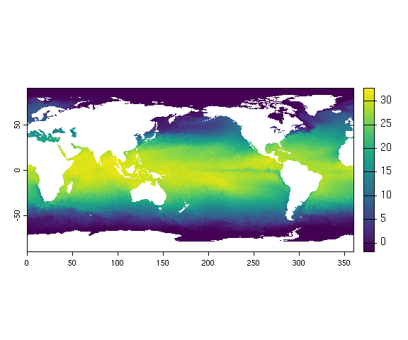
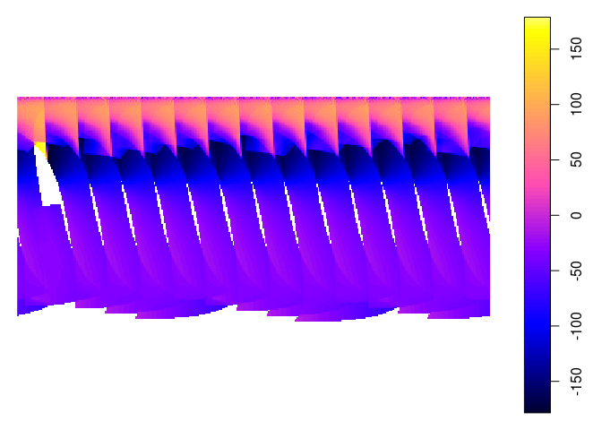
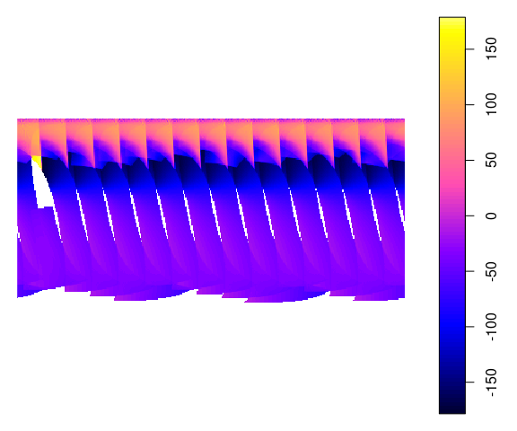
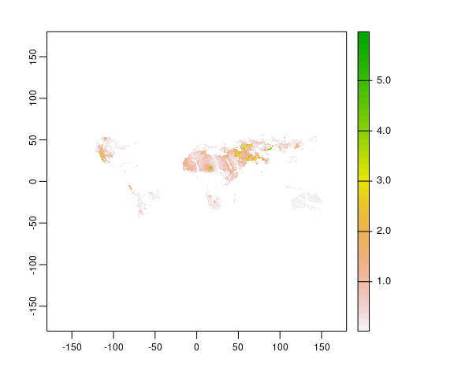
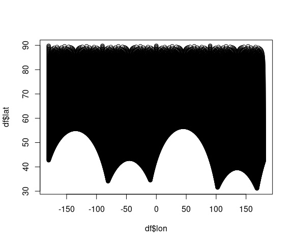
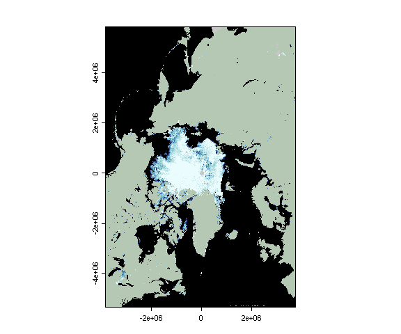

# read-rs-product

How to read common remote sensing products.

## Table of content

-   [L3BIN](#l3bin)
-   [NetCDF4](#netcdf-4)

## L3BIN

Applies to: - MODIS Terra and Aqua

HDF5 L3BIN files can be read using the `rhdf5` package from
bioconductor. The installation can be done as follow:

``` r
# https://bioconductor.org/install/

if (!require("BiocManager", quietly = TRUE))
    install.packages("BiocManager")

BiocManager::install(version = "3.14")

BiocManager::install("rhdf5")

library("rhdf5")
```

The `h5ls()` function will list all the layers included in the file:

``` r
library(rhdf5)

h5ls("data/A2016160.L3b_DAY_CHL.nc")
```

    #> Datatype: binDataType
    #> Datatype: binIndexType
    #> Datatype: binListType

    #>                  group                name       otype   dclass     dim
    #> 0                    / level-3_binned_data   H5I_GROUP                 
    #> 1 /level-3_binned_data            BinIndex H5I_DATASET COMPOUND    4320
    #> 2 /level-3_binned_data             BinList H5I_DATASET COMPOUND 1546117
    #> 3 /level-3_binned_data          binDataDim H5I_DATASET    FLOAT       0
    #> 4 /level-3_binned_data         binIndexDim H5I_DATASET    FLOAT       0
    #> 5 /level-3_binned_data          binListDim H5I_DATASET    FLOAT       0
    #> 6 /level-3_binned_data             chl_ocx H5I_DATASET COMPOUND 1546117
    #> 7 /level-3_binned_data             chlor_a H5I_DATASET COMPOUND 1546117
    #> 8                    /  processing_control   H5I_GROUP                 
    #> 9  /processing_control    input_parameters   H5I_GROUP

Finally, use `h5read()` to open a specific layer:

``` r
df <- h5read("data/A2016160.L3b_DAY_CHL.nc", "/level-3_binned_data/chlor_a")
head(df)
```

    #>         sum sum_squared
    #> 1 0.6973728   0.3438865
    #> 2 1.0581876   0.4339271
    #> 3 0.8196706   0.3075230
    #> 4 0.5595803   0.2214183
    #> 5 0.9581555   0.4194749
    #> 6 0.8865827   0.3568407

Where:

-   `sum` = the sum of the pixels in the bin
-   `sum_squared` = the squared sum

It is to be noted that the observed values need to be weighted. The
weighted values can be found in the `BinList` layer:

``` r
bins <- h5read("data/A2016160.L3b_DAY_CHL.nc", "/level-3_binned_data/BinList")

df$sum <- df$sum / bins$weights

head(df)
```

    #>         sum sum_squared
    #> 1 0.4931170   0.3438865
    #> 2 0.3999573   0.4339271
    #> 3 0.3665678   0.3075230
    #> 4 0.3956830   0.2214183
    #> 5 0.4285002   0.4194749
    #> 6 0.3964918   0.3568407

In Matlab:

``` matlab
res = h5read('A2016009.L3b_DAY_CHL.nc', '/level-3_binned_data/chlor_a');
```

## NetCDF 4

These files can be opened using the `ncdf4` package.

``` r
install.packages("ncdf4")
```

Layers in the file can be listed using the `nc_open()` function:

``` r
library(ncdf4)
f <- nc_open("data/avhrr-only-v2.20160503.nc")
f
```

    #> File data/avhrr-only-v2.20160503.nc (NC_FORMAT_CLASSIC):
    #> 
    #>      4 variables (excluding dimension variables):
    #>         short sst[lon,lat,zlev,time]   
    #>             long_name: Daily sea surface temperature
    #>             units: degrees C
    #>             _FillValue: -999
    #>             add_offset: 0
    #>             scale_factor: 0.00999999977648258
    #>             valid_min: -300
    #>             valid_max: 4500
    #>         short anom[lon,lat,zlev,time]   
    #>             long_name: Daily sea surface temperature anomalies
    #>             units: degrees C
    #>             _FillValue: -999
    #>             add_offset: 0
    #>             scale_factor: 0.00999999977648258
    #>             valid_min: -1200
    #>             valid_max: 1200
    #>         short err[lon,lat,zlev,time]   
    #>             long_name: Estimated error standard deviation of analysed_sst
    #>             units: degrees C
    #>             _FillValue: -999
    #>             add_offset: 0
    #>             scale_factor: 0.00999999977648258
    #>             valid_min: 0
    #>             valid_max: 1000
    #>         short ice[lon,lat,zlev,time]   
    #>             long_name: Sea ice concentration
    #>             units: percentage
    #>             _FillValue: -999
    #>             add_offset: 0
    #>             scale_factor: 0.00999999977648258
    #>             valid_min: 0
    #>             valid_max: 100
    #> 
    #>      4 dimensions:
    #>         time  Size:1
    #>             long_name: Center time of the day
    #>             units: days since 1978-01-01 00:00:00
    #>         zlev  Size:1
    #>             long_name: Sea surface height
    #>             units: meters
    #>             actual_range: 0, 0
    #>         lat  Size:720
    #>             long_name: Latitude
    #>             units: degrees_north
    #>             grids: Uniform grid from -89.875 to 89.875 by 0.25
    #>         lon  Size:1440
    #>             long_name: Longitude
    #>             units: degrees_east
    #>             grids: Uniform grid from 0.125 to 359.875 by 0.25
    #> 
    #>     7 global attributes:
    #>         Conventions: CF-1.0
    #>         title: Daily-OI-V2, Final, Data (Ship, Buoy, AVHRR: NOAA19, METOP, NCEP-ice)
    #>         History: Version 2.0
    #>         creation_date: 2016-07-01 23:22
    #>         Description: Reynolds, et al.(2007) Daily High-resolution Blended Analyses. Available at ftp://eclipse.ncdc.noaa.gov/pub/OI-daily/daily-sst.pdf  Climatology is based on 1971-2000 OI.v2 SST, Satellite data: Navy  NOAA19 METOP AVHRR, Ice data: NCEP ice
    #>         Source: NOAA/National Climatic Data Center
    #>         Contact: Dick Reynolds, email: Richard.W.Reynolds@noaa.gov & Chunying Liu, email: Chunying.liu@noaa.gov

Opening a specific layer is done with the `ncvar_get()` function:

``` r
sst <- ncvar_get(f, "sst")
dim(sst)
```

    #> [1] 1440  720

It is also possible to open NetCDF4 file using the `raster()` function:

``` r
library(raster)
```

    #> Loading required package: sp

``` r
r <- raster("data/avhrr-only-v2.20160503.nc", varname = "sst") 
r
```

    #> class      : RasterLayer 
    #> dimensions : 720, 1440, 1036800  (nrow, ncol, ncell)
    #> resolution : 0.25, 0.25  (x, y)
    #> extent     : 0, 360, -90, 90  (xmin, xmax, ymin, ymax)
    #> crs        : +proj=longlat +datum=WGS84 +no_defs 
    #> source     : avhrr-only-v2.20160503.nc 
    #> names      : Daily.sea.surface.temperature 
    #> z-value    : 2016-05-03 
    #> zvar       : sst 
    #> level      : 1

``` r
plot(r)
```

<!-- -->

Note the longitudes are from 0 to 360 degrees. It is easy to change that
so the image is correctly displayed:

``` r
library(sp)

coords <- coordinates(r)
head(coords)
```

    #>          x      y
    #> [1,] 0.125 89.875
    #> [2,] 0.375 89.875
    #> [3,] 0.625 89.875
    #> [4,] 0.875 89.875
    #> [5,] 1.125 89.875
    #> [6,] 1.375 89.875

``` r
coords[1, ] <- ifelse(coords[1, ] > 180, coords[1, ] - 360, coords[1, ])
# coordinates(r) <- coords

plot(r)
```

<!-- -->

## HDF4

<http://hdfeos.org/software/r.php>

``` r
library(rgdal)
```

    #> Please note that rgdal will be retired by the end of 2023,
    #> plan transition to sf/stars/terra functions using GDAL and PROJ
    #> at your earliest convenience.
    #> 
    #> rgdal: version: 1.5-27, (SVN revision 1148)
    #> Geospatial Data Abstraction Library extensions to R successfully loaded
    #> Loaded GDAL runtime: GDAL 3.0.4, released 2020/01/28
    #> Path to GDAL shared files: /usr/share/gdal
    #> GDAL binary built with GEOS: TRUE 
    #> Loaded PROJ runtime: Rel. 6.3.1, February 10th, 2020, [PJ_VERSION: 631]
    #> Path to PROJ shared files: /usr/share/proj
    #> Linking to sp version:1.4-5
    #> To mute warnings of possible GDAL/OSR exportToProj4() degradation,
    #> use options("rgdal_show_exportToProj4_warnings"="none") before loading sp or rgdal.

``` r
library(gdalUtils)
sds <- get_subdatasets("data/MYD08_D3.A2003181.051.2008343213114.hdf")

head(sds)
```

    #> [1] "HDF4_EOS:EOS_GRID:data/MYD08_D3.A2003181.051.2008343213114.hdf:mod08:Solar_Zenith_Mean"              
    #> [2] "HDF4_EOS:EOS_GRID:data/MYD08_D3.A2003181.051.2008343213114.hdf:mod08:Solar_Zenith_Standard_Deviation"
    #> [3] "HDF4_EOS:EOS_GRID:data/MYD08_D3.A2003181.051.2008343213114.hdf:mod08:Solar_Zenith_Minimum"           
    #> [4] "HDF4_EOS:EOS_GRID:data/MYD08_D3.A2003181.051.2008343213114.hdf:mod08:Solar_Zenith_Maximum"           
    #> [5] "HDF4_EOS:EOS_GRID:data/MYD08_D3.A2003181.051.2008343213114.hdf:mod08:Solar_Zenith_Pixel_Counts"      
    #> [6] "HDF4_EOS:EOS_GRID:data/MYD08_D3.A2003181.051.2008343213114.hdf:mod08:Solar_Azimuth_Mean"

``` r
dat <- readGDAL(sds[6])
```

    #> HDF4_EOS:EOS_GRID:data/MYD08_D3.A2003181.051.2008343213114.hdf:mod08:Solar_Azimuth_Mean has GDAL driver HDF4Image 
    #> and has 180 rows and 360 columns

    #> Warning in getProjectionRef(x, OVERRIDE_PROJ_DATUM_WITH_TOWGS84 =
    #> OVERRIDE_PROJ_DATUM_WITH_TOWGS84, : Discarded datum Not specified (based on
    #> Clarke 1866 spheroid) in Proj4 definition: +proj=longlat +ellps=clrk66 +no_defs

    #> Warning in showSRID(uprojargs, format = "PROJ", multiline = "NO", prefer_proj
    #> = prefer_proj): Discarded datum Unknown based on Clarke 1866 ellipsoid in Proj4
    #> definition

``` r
plot(dat)
```

<!-- -->

With the the `terra` package.

``` r
library(terra)
```

    #> terra version 1.4.20

    #> 
    #> Attaching package: 'terra'

    #> The following object is masked from 'package:rgdal':
    #> 
    #>     project

``` r
filename <- "data/MYD08_D3.A2003181.051.2008343213114.hdf"

sdss <- describe(filename, sds = TRUE, meta = FALSE)

head(sdss)
```

    #>   id
    #> 1  1
    #> 2  2
    #> 3  3
    #> 4  4
    #> 5  5
    #> 6  6
    #>                                                                                                     name
    #> 1               HDF4_EOS:EOS_GRID:"data/MYD08_D3.A2003181.051.2008343213114.hdf":mod08:Solar_Zenith_Mean
    #> 2 HDF4_EOS:EOS_GRID:"data/MYD08_D3.A2003181.051.2008343213114.hdf":mod08:Solar_Zenith_Standard_Deviation
    #> 3            HDF4_EOS:EOS_GRID:"data/MYD08_D3.A2003181.051.2008343213114.hdf":mod08:Solar_Zenith_Minimum
    #> 4            HDF4_EOS:EOS_GRID:"data/MYD08_D3.A2003181.051.2008343213114.hdf":mod08:Solar_Zenith_Maximum
    #> 5       HDF4_EOS:EOS_GRID:"data/MYD08_D3.A2003181.051.2008343213114.hdf":mod08:Solar_Zenith_Pixel_Counts
    #> 6              HDF4_EOS:EOS_GRID:"data/MYD08_D3.A2003181.051.2008343213114.hdf":mod08:Solar_Azimuth_Mean
    #>                                     var
    #> 1               mod08:Solar_Zenith_Mean
    #> 2 mod08:Solar_Zenith_Standard_Deviation
    #> 3            mod08:Solar_Zenith_Minimum
    #> 4            mod08:Solar_Zenith_Maximum
    #> 5       mod08:Solar_Zenith_Pixel_Counts
    #> 6              mod08:Solar_Azimuth_Mean
    #>                                                               desc nrow ncol
    #> 1               [180x360] Solar_Zenith_Mean mod08 (16-bit integer)  180  360
    #> 2 [180x360] Solar_Zenith_Standard_Deviation mod08 (16-bit integer)  180  360
    #> 3            [180x360] Solar_Zenith_Minimum mod08 (16-bit integer)  180  360
    #> 4            [180x360] Solar_Zenith_Maximum mod08 (16-bit integer)  180  360
    #> 5       [180x360] Solar_Zenith_Pixel_Counts mod08 (16-bit integer)  180  360
    #> 6              [180x360] Solar_Azimuth_Mean mod08 (16-bit integer)  180  360
    #>   nlyr
    #> 1    1
    #> 2    1
    #> 3    1
    #> 4    1
    #> 5    1
    #> 6    1

``` r
r <- rast(filename, 142)

plot(r)
```

<!-- -->

## NSIDC data

``` r
sic <- readBin("data/nsidc/nt_20171002_f17_v1.1_n.bin",
  what = "integer",
  n = 304 * 448,
  size = 1,
  signed = F
)

lat <-
  readBin(
    "data/nsidc/psn25lats_v3.dat",
    what = "integer",
    n = 304 * 448,
    size = 4,
    signed = TRUE
  )

lon <-
  readBin(
    "data/nsidc/psn25lons_v3.dat",
    what = "integer",
    n = 304 * 448,
    size = 4,
    signed = TRUE
  )

df <- data.frame(lat = lat / 100000, lon = lon / 100000, thickness = sic)

plot(df$lon, df$lat)
```

<!-- -->

``` r
library(tidyverse)
```

    #> ── Attaching packages ─────────────────────────────────────── tidyverse 1.3.1 ──

    #> ✓ ggplot2 3.3.5     ✓ purrr   0.3.4
    #> ✓ tibble  3.1.6     ✓ dplyr   1.0.7
    #> ✓ tidyr   1.1.4     ✓ stringr 1.4.0
    #> ✓ readr   2.1.0     ✓ forcats 0.5.1

    #> ── Conflicts ────────────────────────────────────────── tidyverse_conflicts() ──
    #> x tidyr::extract()  masks terra::extract(), raster::extract()
    #> x dplyr::filter()   masks stats::filter()
    #> x dplyr::lag()      masks stats::lag()
    #> x dplyr::select()   masks raster::select()
    #> x purrr::simplify() masks terra::simplify()
    #> x dplyr::src()      masks terra::src()

``` r
df %>% 
  ggplot(aes(x = lon, y = lat, color = sic)) +
  geom_point()
```

<!-- -->
