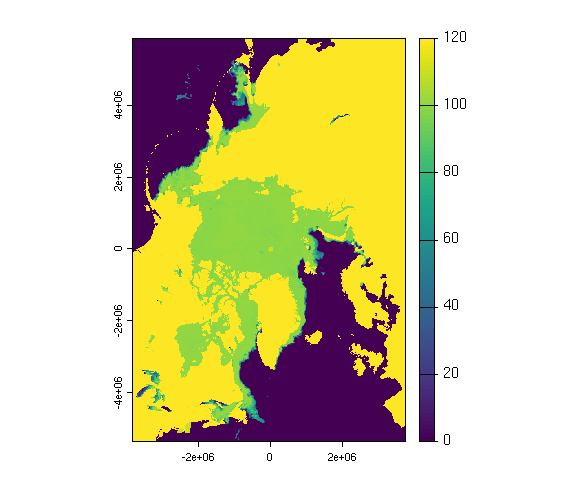

# read-rs-product

How to read common remote sensing products.

## Table of content

- [L3BIN](#l3bin)
- [NetCDF4](#netcdf-4)

## L3BIN

Applies to:

- MODIS Terra and Aqua

HDF5 L3BIN files can be read using the `rhdf5` package from
bioconductor. The installation can be done as follow:

``` r
# https://bioconductor.org/install/

if (!require("BiocManager", quietly = TRUE)) {
  install.packages("BiocManager")
}

BiocManager::install()

BiocManager::install("rhdf5")

library("rhdf5")
```

The `h5ls()` function will list all the layers included in the file:

``` r
library(rhdf5)

h5ls("data/A2016160.L3b_DAY_CHL.nc")
```

    #> Datatype: binDataType
    #> Datatype: binIndexType
    #> Datatype: binListType

    #>                  group                name       otype   dclass     dim
    #> 0                    / level-3_binned_data   H5I_GROUP                 
    #> 1 /level-3_binned_data            BinIndex H5I_DATASET COMPOUND    4320
    #> 2 /level-3_binned_data             BinList H5I_DATASET COMPOUND 1546117
    #> 3 /level-3_binned_data          binDataDim H5I_DATASET    FLOAT       0
    #> 4 /level-3_binned_data         binIndexDim H5I_DATASET    FLOAT       0
    #> 5 /level-3_binned_data          binListDim H5I_DATASET    FLOAT       0
    #> 6 /level-3_binned_data             chl_ocx H5I_DATASET COMPOUND 1546117
    #> 7 /level-3_binned_data             chlor_a H5I_DATASET COMPOUND 1546117
    #> 8                    /  processing_control   H5I_GROUP                 
    #> 9  /processing_control    input_parameters   H5I_GROUP

Finally, use `h5read()` to open a specific layer:

``` r
df <- h5read("data/A2016160.L3b_DAY_CHL.nc", "/level-3_binned_data/chlor_a")
head(df)
```

    #>         sum sum_squared
    #> 1 0.6973728   0.3438865
    #> 2 1.0581876   0.4339271
    #> 3 0.8196706   0.3075230
    #> 4 0.5595803   0.2214183
    #> 5 0.9581555   0.4194749
    #> 6 0.8865827   0.3568407

Where:

- `sum` = the sum of the pixels in the bin
- `sum_squared` = the squared sum

It is to be noted that the observed values need to be weighted. The
weighted values can be found in the `BinList` layer:

``` r
bins <- h5read("data/A2016160.L3b_DAY_CHL.nc", "/level-3_binned_data/BinList")

df[["sum"]] <- df[["sum"]] / bins[["weights"]]

head(df)
```

    #>         sum sum_squared
    #> 1 0.4931170   0.3438865
    #> 2 0.3999573   0.4339271
    #> 3 0.3665678   0.3075230
    #> 4 0.3956830   0.2214183
    #> 5 0.4285002   0.4194749
    #> 6 0.3964918   0.3568407

## NetCDF 4

These files can be opened using the `ncdf4` package.

``` r
install.packages("ncdf4")
```

Layers in the file can be listed using the `nc_open()` function:

``` r
library(ncdf4)
f <- nc_open("data/avhrr-only-v2.20160503.nc")
f
```

    #> File data/avhrr-only-v2.20160503.nc (NC_FORMAT_CLASSIC):
    #> 
    #>      4 variables (excluding dimension variables):
    #>         short sst[lon,lat,zlev,time]   
    #>             long_name: Daily sea surface temperature
    #>             units: degrees C
    #>             _FillValue: -999
    #>             add_offset: 0
    #>             scale_factor: 0.00999999977648258
    #>             valid_min: -300
    #>             valid_max: 4500
    #>         short anom[lon,lat,zlev,time]   
    #>             long_name: Daily sea surface temperature anomalies
    #>             units: degrees C
    #>             _FillValue: -999
    #>             add_offset: 0
    #>             scale_factor: 0.00999999977648258
    #>             valid_min: -1200
    #>             valid_max: 1200
    #>         short err[lon,lat,zlev,time]   
    #>             long_name: Estimated error standard deviation of analysed_sst
    #>             units: degrees C
    #>             _FillValue: -999
    #>             add_offset: 0
    #>             scale_factor: 0.00999999977648258
    #>             valid_min: 0
    #>             valid_max: 1000
    #>         short ice[lon,lat,zlev,time]   
    #>             long_name: Sea ice concentration
    #>             units: percentage
    #>             _FillValue: -999
    #>             add_offset: 0
    #>             scale_factor: 0.00999999977648258
    #>             valid_min: 0
    #>             valid_max: 100
    #> 
    #>      4 dimensions:
    #>         time  Size:1 
    #>             long_name: Center time of the day
    #>             units: days since 1978-01-01 00:00:00
    #>         zlev  Size:1 
    #>             long_name: Sea surface height
    #>             units: meters
    #>             actual_range: 0, 0
    #>         lat  Size:720 
    #>             long_name: Latitude
    #>             units: degrees_north
    #>             grids: Uniform grid from -89.875 to 89.875 by 0.25
    #>         lon  Size:1440 
    #>             long_name: Longitude
    #>             units: degrees_east
    #>             grids: Uniform grid from 0.125 to 359.875 by 0.25
    #> 
    #>     7 global attributes:
    #>         Conventions: CF-1.0
    #>         title: Daily-OI-V2, Final, Data (Ship, Buoy, AVHRR: NOAA19, METOP, NCEP-ice)
    #>         History: Version 2.0
    #>         creation_date: 2016-07-01 23:22
    #>         Description: Reynolds, et al.(2007) Daily High-resolution Blended Analyses. Available at ftp://eclipse.ncdc.noaa.gov/pub/OI-daily/daily-sst.pdf  Climatology is based on 1971-2000 OI.v2 SST, Satellite data: Navy  NOAA19 METOP AVHRR, Ice data: NCEP ice
    #>         Source: NOAA/National Climatic Data Center
    #>         Contact: Dick Reynolds, email: Richard.W.Reynolds@noaa.gov & Chunying Liu, email: Chunying.liu@noaa.gov

Opening a specific layer is done with the `ncvar_get()` function:

``` r
sst <- ncvar_get(f, "sst")
dim(sst)
```

    #> [1] 1440  720

It is also possible to open NetCDF4 file using the `rast()` function:

``` r
library(terra)
r <- rast("data/avhrr-only-v2.20160503.nc", lyrs = 1L)

r
```

    #> class       : SpatRaster 
    #> dimensions  : 720, 1440, 1  (nrow, ncol, nlyr)
    #> resolution  : 0.25, 0.25  (x, y)
    #> extent      : 0, 360, -90, 90  (xmin, xmax, ymin, ymax)
    #> coord. ref. : lon/lat WGS 84 (CRS84) (OGC:CRS84) 
    #> source      : avhrr-only-v2.20160503.nc:sst 
    #> varname     : sst (Daily sea surface temperature) 
    #> name        : sst_zlev=0 
    #> unit        :  degrees C 
    #> time (days) : 2016-05-03

``` r
plot(r)
```

<!-- -->

Rotate the raster:

``` r
r <- rotate(r)

plot(r)
```

<!-- -->

## HDF4

<http://hdfeos.org/software/r.php>

``` r
library(terra)

filename <- "data/MYD08_D3.A2003181.051.2008343213114.hdf"

sdss <- describe(filename, sds = TRUE, meta = FALSE, parse = FALSE)

head(sdss)
```

    #>   id
    #> 1  1
    #> 2  2
    #> 3  3
    #> 4  4
    #> 5  5
    #> 6  6
    #>                                                                                                     name
    #> 1               HDF4_EOS:EOS_GRID:"data/MYD08_D3.A2003181.051.2008343213114.hdf":mod08:Solar_Zenith_Mean
    #> 2 HDF4_EOS:EOS_GRID:"data/MYD08_D3.A2003181.051.2008343213114.hdf":mod08:Solar_Zenith_Standard_Deviation
    #> 3            HDF4_EOS:EOS_GRID:"data/MYD08_D3.A2003181.051.2008343213114.hdf":mod08:Solar_Zenith_Minimum
    #> 4            HDF4_EOS:EOS_GRID:"data/MYD08_D3.A2003181.051.2008343213114.hdf":mod08:Solar_Zenith_Maximum
    #> 5       HDF4_EOS:EOS_GRID:"data/MYD08_D3.A2003181.051.2008343213114.hdf":mod08:Solar_Zenith_Pixel_Counts
    #> 6              HDF4_EOS:EOS_GRID:"data/MYD08_D3.A2003181.051.2008343213114.hdf":mod08:Solar_Azimuth_Mean
    #>                               var
    #> 1               Solar_Zenith_Mean
    #> 2 Solar_Zenith_Standard_Deviation
    #> 3            Solar_Zenith_Minimum
    #> 4            Solar_Zenith_Maximum
    #> 5       Solar_Zenith_Pixel_Counts
    #> 6              Solar_Azimuth_Mean
    #>                                                               desc nrow ncol nlyr
    #> 1               [180x360] Solar_Zenith_Mean mod08 (16-bit integer)  180  360    1
    #> 2 [180x360] Solar_Zenith_Standard_Deviation mod08 (16-bit integer)  180  360    1
    #> 3            [180x360] Solar_Zenith_Minimum mod08 (16-bit integer)  180  360    1
    #> 4            [180x360] Solar_Zenith_Maximum mod08 (16-bit integer)  180  360    1
    #> 5       [180x360] Solar_Zenith_Pixel_Counts mod08 (16-bit integer)  180  360    1
    #> 6              [180x360] Solar_Azimuth_Mean mod08 (16-bit integer)  180  360    1

``` r
r <- rast(filename, 142L)

plot(r)
```

<!-- -->

## NSIDC data

``` r
sic <- readBin("data/nsidc/nt_20171002_f17_v1.1_n.bin",
  what = "integer",
  n = 304 * 448,
  size = 1,
  signed = F
)

lat <-
  readBin(
    "data/nsidc/psn25lats_v3.dat",
    what = "integer",
    n = 304 * 448,
    size = 4,
    signed = TRUE
  )

lon <-
  readBin(
    "data/nsidc/psn25lons_v3.dat",
    what = "integer",
    n = 304 * 448,
    size = 4,
    signed = TRUE
  )

df <- data.frame(lat = lat / 100000, lon = lon / 100000, thickness = sic)

plot(df$lon, df$lat)
```

<!-- -->

``` r
library(tidyverse)
df %>%
  ggplot(aes(x = lon, y = lat, color = sic)) +
  geom_point()
```

<!-- -->

## Sea ice concentration

<ftp://ftp.awi.de/sea_ice/product/amsr2>

``` r
library(terra)

r <- rast("/vsicurl/ftp://ftp.awi.de/sea_ice/product/amsr2/v110/nh/2022/08/nh_SIC-LEADS_2022080400_080412.tiff")

r
```

    #> class       : SpatRaster 
    #> dimensions  : 3584, 2432, 1  (nrow, ncol, nlyr)
    #> resolution  : 3125, 3125  (x, y)
    #> extent      : -3850000, 3750000, -5350000, 5850000  (xmin, xmax, ymin, ymax)
    #> coord. ref. : WGS 84 / NSIDC Sea Ice Polar Stereographic North (EPSG:3413) 
    #> source      : nh_SIC-LEADS_2022080400_080412.tiff 
    #> color table : 1 
    #> name        : nh_SIC-LEADS_2022080400_080412

``` r
plot(r)
```

<!-- -->

## h5e file

<https://gist.github.com/mdsumner/08265bac3faf1e4325e2d5a39a5f66bf>

``` r
library(terra)
library(gdalraster)
library(stars)

file <- "./data/AMSR_U2_L3_SeaIce12km_B04_20140314.he5"
sub <- paste0("NetCDF:", file, ":")

sds <- gdal_subdatasets(sub)

sf::gdal_utils("info", unlist(sds)[30])
```

    #> Driver: netCDF/Network Common Data Format
    #> Files: ./data/AMSR_U2_L3_SeaIce12km_B04_20140314.he5
    #> Size is 608, 896
    #> Metadata:
    #>   /HDFEOS INFORMATION/NC_GLOBAL#HDFEOSVersion=HDFEOS_5.1.15
    #>   /HDFEOS/GRIDS/NpPolarGrid12km/Data Fields/SI_12km_NH_ICECON_DAY#comment=data value meaning: 0 -- Open Water, 110 -- missing/not calculated, 120 -- Land
    #>   /HDFEOS/GRIDS/NpPolarGrid12km/Data Fields/SI_12km_NH_ICECON_DAY#coordinates=lon lat
    #>   /HDFEOS/GRIDS/NpPolarGrid12km/Data Fields/SI_12km_NH_ICECON_DAY#long_name=Sea ice concentration daily average
    #>   /HDFEOS/GRIDS/NpPolarGrid12km/Data Fields/SI_12km_NH_ICECON_DAY#units=percent
    #>   NC_GLOBAL#Conventions=CF-1.6
    #>   NC_GLOBAL#history=This version of the Sea Ice processing code contains updates provided by the science team on September 16, 2019. For details on these updates, see the release notes provided in the DAP.
    #>   NC_GLOBAL#institution=NASA's AMSR Science Investigator-led Processing System (SIPS)
    #>   NC_GLOBAL#references=Please cite these data as: Markus, T., J. C. Comiso, and W. N. Meier. 2018. AMSR-E/AMSR2 Unified L3 Daily 12.5 km Brightness Temperatures, Sea Ice Concentration, Motion & Snow Depth Polar Grids, Version 1. [Indicate subset used]. Boulder, Colorado USA. NASA National Snow and Ice Data Center Distributed Active Archive Center. doi: https://doi.org/10.5067/RA1MIJOYPK3P.
    #>   NC_GLOBAL#source=satellite observation
    #>   NC_GLOBAL#title=AMSR-E/AMSR2 Unified L3 Daily 12.5 km Brightness Temperatures, Sea Ice Concentration, Motion & Snow Depth Polar Grids
    #> Geolocation:
    #>   GEOREFERENCING_CONVENTION=PIXEL_CENTER
    #>   LINE_OFFSET=0
    #>   LINE_STEP=1
    #>   PIXEL_OFFSET=0
    #>   PIXEL_STEP=1
    #>   SRS=GEOGCS["WGS 84",DATUM["WGS_1984",SPHEROID["WGS 84",6378137,298.257223563,AUTHORITY["EPSG","7030"]],AUTHORITY["EPSG","6326"]],PRIMEM["Greenwich",0,AUTHORITY["EPSG","8901"]],UNIT["degree",0.0174532925199433,AUTHORITY["EPSG","9122"]],AXIS["Latitude",NORTH],AXIS["Longitude",EAST],AUTHORITY["EPSG","4326"]]
    #>   X_BAND=1
    #>   X_DATASET=NETCDF:"./data/AMSR_U2_L3_SeaIce12km_B04_20140314.he5":/HDFEOS/GRIDS/NpPolarGrid12km/lon
    #>   Y_BAND=1
    #>   Y_DATASET=NETCDF:"./data/AMSR_U2_L3_SeaIce12km_B04_20140314.he5":/HDFEOS/GRIDS/NpPolarGrid12km/lat
    #> Corner Coordinates:
    #> Upper Left  (    0.0,    0.0)
    #> Lower Left  (    0.0,  896.0)
    #> Upper Right (  608.0,    0.0)
    #> Lower Right (  608.0,  896.0)
    #> Center      (  304.0,  448.0)
    #> Band 1 Block=608x1 Type=Int32, ColorInterp=Undefined
    #>   Unit Type: percent
    #>   Metadata:
    #>     comment=data value meaning: 0 -- Open Water, 110 -- missing/not calculated, 120 -- Land
    #>     coordinates=lon lat
    #>     long_name=Sea ice concentration daily average
    #>     NETCDF_VARNAME=SI_12km_NH_ICECON_DAY
    #>     units=percent

``` r
dsn <- "/vsimem/temp.vrt"
sf::gdal_utils(
  "warp",
  unlist(sds)[30],
  dsn,
  options = c("-t_srs", "EPSG:3411", "-overwrite")
)

r <- rast(dsn)

plot(r)
```

<!-- -->
